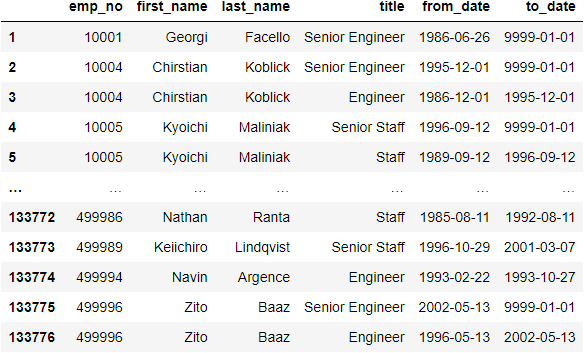
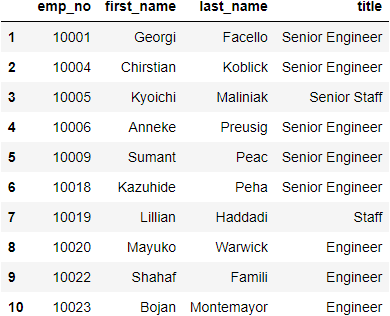
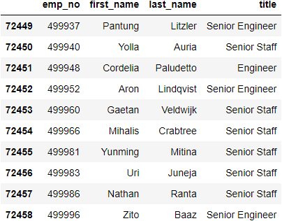
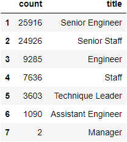
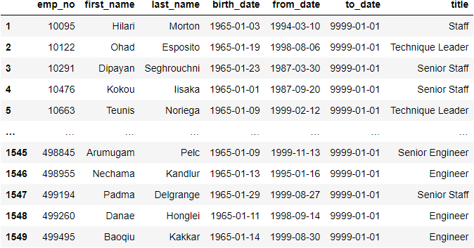
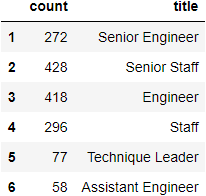
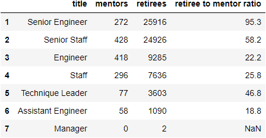

# Pewlett-Hackard Retirement Analysis

## Overview
Pewlett-Hackard would like to examine employee data to determine which employess are likely to retire soon and which senior employees can serve as mentors to younger employees.

## Resources
- Software:
  - PostgreSQL 11.16
    - Result tables output as CSV files 
  - Python 3.10.4
    - Pandas package (to process DataFrames on output CSVs—see above)
    - dataframe_image package (to save Pandas Dataframes as images)
  - Jupyter Notebook (used for the DataFrames)
- Original Data Sources:
  - departments.csv
  - dept_emp.csv
  - dept_manager.csv
  - employees.csv
  - salaries.csv
  - titles.csv
- SQL Query File (contains queries to produce the tables below):
  - Employee_Database_challenge.sql

## Analysis
### Retiring Employees
We began by looking for employees who were born between 1952 and 1955 under the premise that these are the employees approaching retirement age. We also examined these employees' titles because when such an employee retires, not only does Pewlitt-Hackard lose an employee, it also creates a vacancy in that employee's former role.

We can see the first and last ten results[^1] of this analysis, here:

| Potential Retirees |
| :-: |
|  |

[^1]: There is nothing of particular import about the first and last results. They are shown simply to give an idea of the kind of data examined and a count of how many are of retirement age.

This data, by itself, is not especially useful because it not only includes employees who are nearing retirement age, but also includes *former* employees who are no longer with the company. It also over-counts employees who have had more than one title at Pewlett-Hackard.

We therefore refined the search, looking instead only for unique, *current* employees approaching retirement:

Retiring Employees and Titles

| First Ten | Last Ten |
| :-: | :-: |
|  |  |

#### Expected Vacancies per Job Title
Here we see how many vacancies we expect to see should each of the above employees retire:

| Retirees by Title |
| :-: |
|  |

[Note that total number of Retirees by Title is 72,458, the same as the number of retiring employees we found in the previous table.]

### Potential Mentors
In order to preserve Pewlett-Hackard's institutional knowledge, we also looked for current employees born in 1965 who could serve as mentors to younger and newer employees.

A subset of these potential mentors appears below:

| Potential Mentors |
| :-: |
|  |

#### Potential Mentors per Job Title
Here we see the number of mentors available to Pewlett-Hackard, broken down by title:

| Mentors by Title |
| :-: |
|  |

### Retirees per Mentor
Assuming Pewlett-Hackard will want to replace their employees who retire, we can estimate that the number of new employees in a given job title will match the number who retire from that title.

Thus, if we compare the number of mentors and retirees and examine the ratio of retirees to mentors, we get an idea about the number of new employees (the same as the number of retirees) each mentor will have to oversee:

| Mentors and Retirees by Title |
| :-: |
|  |

## Results
Some points that stand out from the above data:
- **72,458** employees are about to retire.
- The titles with the greatest number of retirees are *Senior Engineer* (**25,916** retirees), *Senior Staff* (**24,926** retirees), and *Engineer* (**9,285** retirees).
- Pewlett-Hackard has **1,549** potential mentors available.
- On average, each mentor will have between **19** (for an *Assistant Engineer*) and **95** (for a *Senior Engineer*) new employees to mentor.[^2]

[^2]: *Manager*s are excluded because there are no potential mentors for the *Manager* title.

## Summary
Replacing the **72,458** employees will be a difficult task. The number of mentors—even at the low end—is woefully insufficient to train the new crop of employees. It might be possible for *Assistant Engineers* (with an approximately **19-to-1** trainee-mentor ratio) to train the new employees, but they'll likely be unable to perform their regular duties while doing so, given that even full-time classroom teachers have student-teacher ratios in the twenties[^3]. To ask *Senior Engineers* (with their **95-to-1** trainee-mentor ratio) to accomplish this training goal is likely an impossible request.

[^3]: Source [National Teacher and Principal Survey, 2017–2018](https://nces.ed.gov/surveys/ntps/tables/ntps1718_fltable06_t1s.asp)